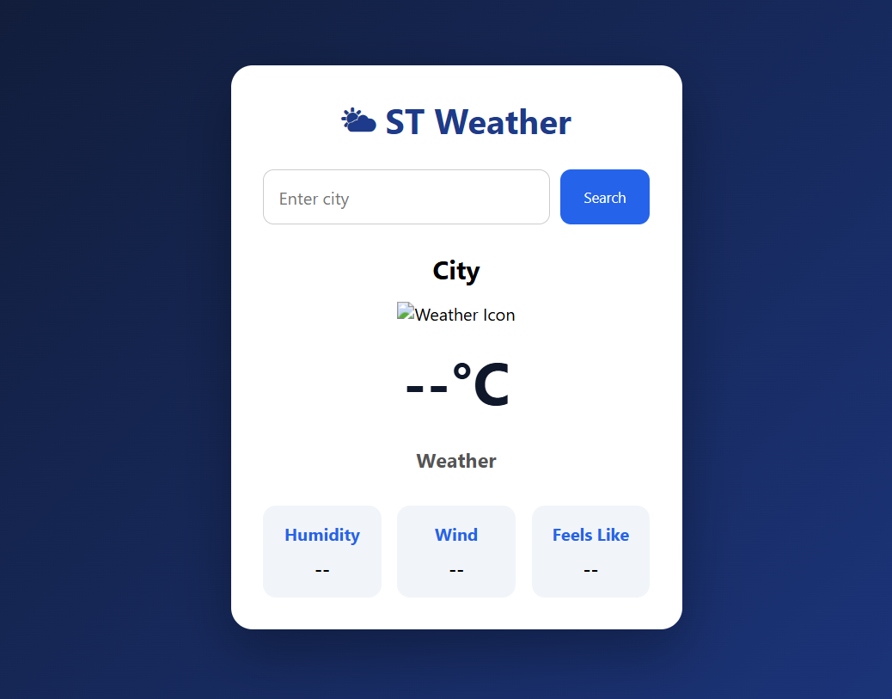
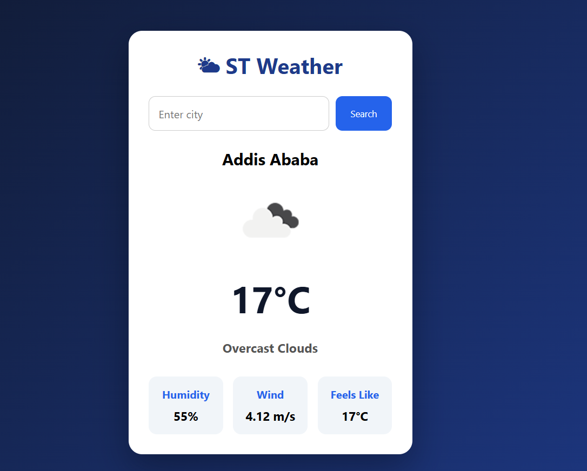

# 🌦️ Weather Dashboard

A simple, interactive weather dashboard built with **HTML, CSS, and JavaScript**. Search for a city to view its current weather conditions, temperature, humidity, wind speed, and feels-like temperature.

## ✨ Features

* 🔍 **City Search** — Search for a city to retrieve its current weather information.
* 🌡️ **Temperature** — Display the current temperature in Celsius.
* 🌤️ **Weather Conditions** — View a description of the current weather and its corresponding icon.
* 💧 **Humidity** — See the current humidity percentage.
* 💨 **Wind Speed** — Display wind speed in meters per second.
* 🌡️ **Feels-Like Temperature** — Check how warm or cold it feels.
* ⚠️ **Error Handling** — Display an error message when a city cannot be found or a request fails.

## 🛠️ Technologies Used

* HTML5
* CSS3
* JavaScript (ES6+)
* OpenWeatherMap API
* Fetch API and async/await

## 🌐 Live Demo

[**View Weather Dashboard**](https://weather-dashboard-by-azariya.vercel.app/)

Try searching for a city to see its current weather, temperature, humidity, wind speed, and feels-like temperature.


## 📸 Screenshots

### Weather Dashboard



### Weather Search Result



## 🚀 Getting Started

### Prerequisites

* A modern web browser
* An OpenWeatherMap API key

### Installation

1. Clone the repository:

   ```bash
   git clone https://github.com/Azaariya/Weather-Dashboard.git
   ```

2. Navigate to the project directory:

   ```bash
   cd Weather-Dashboard
   ```

3. Configure the OpenWeatherMap API integration using your own API key. Do not commit private credentials to a public repository.

4. Open `index.html` in your browser, or use the VS Code Live Server extension.

5. Enter a city name and click the search button to view its current weather.

## 🌍 How It Works

1. Enter a city name in the search field.
2. The application sends a request to the OpenWeatherMap Current Weather API.
3. The returned weather data is processed using JavaScript.
4. The dashboard updates to display the city's weather information.
5. If the request fails, an error message is displayed.

## 🎓 What I Learned

* Fetching data from an external API.
* Working with asynchronous JavaScript using `async` and `await`.
* Processing JSON responses.
* Updating webpage elements dynamically through DOM manipulation.
* Handling failed HTTP requests and errors.
* Displaying weather information using data from an API.

## 🔮 Future Improvements

* Add a loading indicator while weather data is being retrieved.
* Replace alert messages with user-friendly error messages in the interface.
* Support searching weather by country or region.
* Add a multi-day weather forecast.
* Improve the responsive layout for mobile devices.
* Display additional weather details when available.

---

**Built by Azariya**
